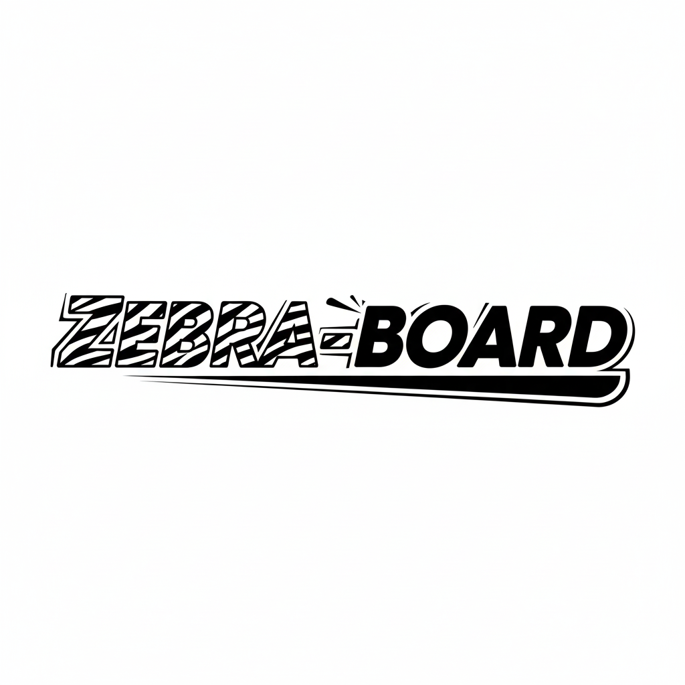

#  Zebra Board

[](https://github.com/your-username/zebra-board)
[](https://nextjs.org/)
[](https://www.typescriptlang.org/)
[](https://tailwindcss.com/)

A modern, feature-rich typing speed test application inspired by [MonkeyType](https://monkeytype.com/). Practice your typing skills with real-time feedback, multiple themes, and comprehensive statistics.


## ✨ Features

- **Real-time WPM & Accuracy Tracking** - Live typing speed and accuracy calculations
- **Multiple Test Modes** - Time-based and word-based typing tests
- **Beautiful Themes** - 6 custom themes with light/dark mode support
- **Responsive Design** - Works on desktop, tablet, and mobile
- **Type-Safe Development** - Built with TypeScript for reliability

## 🛠️ Tech Stack

- **Next.js** - React framework with App Router
- **TypeScript** - Type-safe JavaScript
- **Tailwind CSS** - Utility-first CSS framework
- **Shadcn UI** - Modern component library

## 🚀 Getting Started

### Prerequisites
- Node.js 18.0 or higher
- pnpm, npm, or yarn

### Installation

1. **Clone and install:**
    ```bash
    git clone https://github.com/your-username/zebra-board.git
    cd zebra-board
    npm install
    ```

2. **Generate themes:**
    ```bash
    npm run generate-themes
    ```

3. **Start development server:**
    ```bash
    npm run dev
    ```

4. **Open [http://localhost:3000](http://localhost:3000)**


## 📜 Scripts

```bash
npm run dev              # Start development server
npm run build           # Build for production
npm run lint            # Run ESLint
npm run generate-themes # Generate theme CSS
```

## 🤝 Contributing

We welcome contributions! See [CONTRIBUTING.md](CONTRIBUTING.md) for guidelines.

## 📄 License

This project is open source and available under the [MIT License](LICENSE).

## 🙏 Acknowledgments

- Inspired by [MonkeyType](https://monkeytype.com/)
- Built with [Next.js](https://nextjs.org/)
- UI components from [Shadcn UI](https://ui.shadcn.com/)
- Icons from [Lucide](https://lucide.dev/)

---

<div align="center">
  <p>Built with ❤️ using Next.js and TypeScript</p>
  <p>
    <a href="#zebra-board">Back to top</a>
  </p>
</div>
